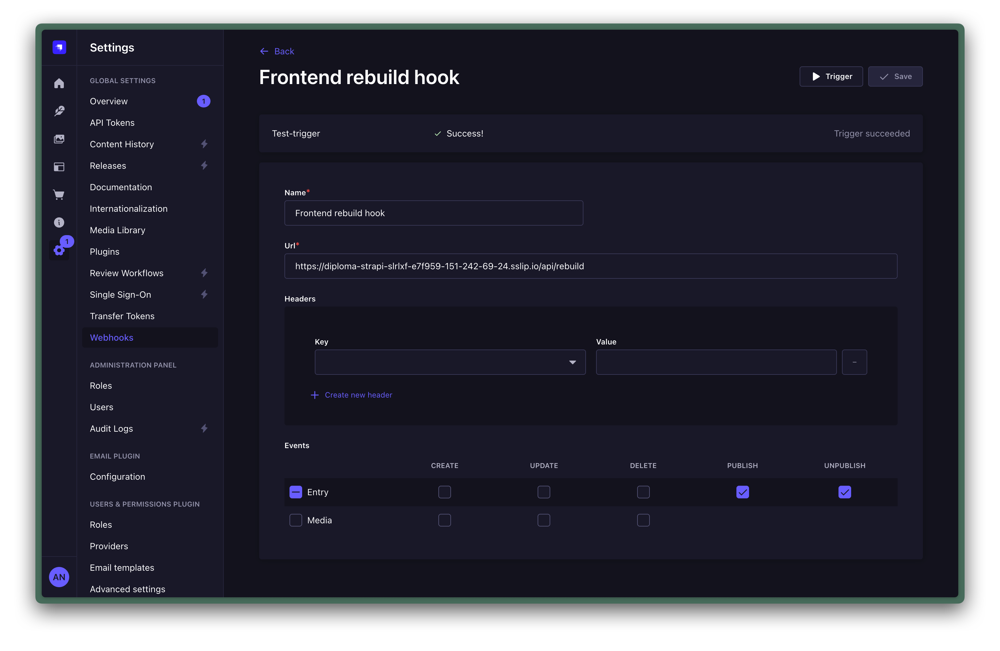

<!-- _class: lead -->

Выпускная квалификационная работа

# Разработка системы управления контентом в сфере маркетинга на базе `Strapi` и `Astro`

09.03.01 Информатика и вычислительная техника · Технологии разработки программного обеспечения

<strong>Исполнитель</strong> 
Нахатакян Артур Романович 
4 курс, очная форма обучения

<strong>Руководитель</strong> 
Государев Илья Борисович 
кандидат пед. наук, доцент

РГПУ им. А. И. Герцена · Санкт-Петербург · 2026

---

## Актуальность, объект, предмет, цель

### Почему тема актуальна

- маркетинговый сайт регулярно обновляется: страницы, статьи, кейсы, вакансии;
- при кодо-центричном подходе редакторские изменения зависят от разработчика;
- `SEO`, локализация и предпросмотр часто оказываются разрозненными;
- требуется единый управляемый контур редактирования и публикации.

### Исследовательская рамка

- **Объект:** процессы управления контентом корпоративного маркетингового сайта.
- **Предмет:** архитектурные и программные решения для `CMS-first` платформы на базе `Strapi` и `Astro`.
- **Цель:** разработать систему, позволяющую управлять страницами, статьями, кейсами и вакансиями без участия разработчика.

Публичная витрина должна получать контент из CMS, а не из ручных правок frontend-кода.

---

## Задачи работы

### Основные задачи

1. Обосновать выбор `CMS-first` архитектуры и связки `Strapi + Astro`.
2. Спроектировать архитектуру и модель данных для ключевых контентных сущностей.
3. Реализовать CMS-контур для `pages`, `articles`, `projects`, `vacancies`.
4. Реализовать публичную витрину с локализацией `ru/en`, `preview`, `SEO` и `sitemap`.
5. Организовать публикационный контур, роли, защиту сценариев и проверку результата.

### Как задачи сводятся в защите

**Задача 1** 
обоснование архитектуры и выбора технологий

**Задача 2** 
контентная модель и CMS-контур

**Задача 3** 
публичная витрина, preview, публикация и проверка

---

## Задача 1. Обоснование архитектуры

<strong>CMS-слой</strong> 
`Strapi` управляет контентом, ролями, публикацией и preview-конфигурацией.

<strong>Frontend-слой</strong> 
`Astro` строит публичные маршруты, `SEO`, `preview` и серверные сценарии.

<strong>Публикационный контур</strong> 
Используется схема `Strapi -> API -> Astro` и `publish -> webhook -> rebuild`.

---

## Задача 2. Контентная модель и CMS-контур

### Что реализовано в CMS

- спроектированы сущности `global`, `home-page`, `page`, `article`, `project`, `vacancy`;
- для страниц реализован конструктор на основе `Dynamic Zone`;
- в `CMS` вынесены тексты, маршрутные параметры и `SEO`-метаданные;
- редактирование и публикация отделены друг от друга.

### Практический результат

- редактор может собрать и обновить страницу без изменения frontend-кода;
- страница становится самостоятельной контентной единицей, а не жестким шаблоном.

При желании в `pptx` сюда можно добавить небольшой фрагмент диаграммы модели данных как дополнительное доказательство.

<strong>Плейсхолдер для доп. скрина</strong> 
Крупный фрагмент `Dynamic Zone` или блока `SEO`, если захотите усилить этот слайд в `pptx`.

---

## Задача 3. Публичная витрина, preview и публикация

### `Preview` черновика

### `Webhook` публикационного контура

- реализованы локализованные маршруты `ru/en` для публичной витрины;
- черновик открывается через защищенный `preview`-сценарий и не раскрывается через публичный API;
- `SEO`, `Open Graph` и `sitemap` формируются в рамках frontend-контура;
- публикация привязана к сценарию `publish -> webhook -> rebuild`.

---

## Результаты работы

| Что подтверждено | Результат |
|---|---|
| Контентный контур | Страницы, статьи, проекты и вакансии управляются через `Strapi`. |
| `Preview` | Черновики доступны только через защищенный `preview`-маршрут. |
| Локализация | Основная витрина работает в контуре `ru/en`. |
| `SEO` и `sitemap` | Метаданные и карта сайта формируются в frontend-контуре. |
| Форменные сценарии | Валидация выполняется на сервере, а не напрямую из браузера в `Strapi`. |
| Публикация | `Webhook` подписан на `publish` и `unpublish`. |
| Сборка | Frontend build формирует `37` публичных маршрутов. |

Практический результат работы — не только код, а рабочая CMS-first система с воспроизводимыми сценариями редактирования, предпросмотра и публикации.

---

## Что показываю в демонстрации

### Шаг 1. CMS

- открыть `page` в `Strapi`;
- показать `Dynamic Zone`;
- показать `SEO`-поля;
- показать статус `draft/published`.

### Шаг 2. Preview

- нажать `Open preview`;
- показать, что черновик виден до публикации;
- подчеркнуть, что это не публичный draft API.

### Шаг 3. Публичная витрина

- открыть `/ru/`;
- открыть `/en/`;
- показать одну CMS-страницу;
- при наличии времени открыть статью, проект или вакансию.

### Шаг 4. Публикация

- коротко показать webhook в `Strapi`;
- объяснить цепочку `publish -> webhook -> rebuild`;
- не запускать долгий live rebuild.

<strong>Плейсхолдер:</strong> если захотите, в `pptx` можно добавить маленькие миниатюры экранов `/ru/`, `/en/` и `preview`.

---

<!-- _class: lead -->

## Заключение

# Разработана `CMS-first` система управления контентом для маркетингового сайта

`Strapi` используется как центр контентного управления, `Astro` — как публичная витрина с локализацией, preview и предсказуемым публикационным сценарием.

Strapi + Astro
ru/en
preview
SEO / sitemap
webhook -> rebuild

Спасибо за внимание

