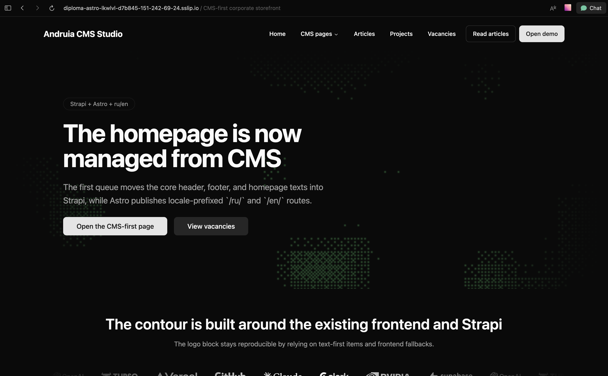
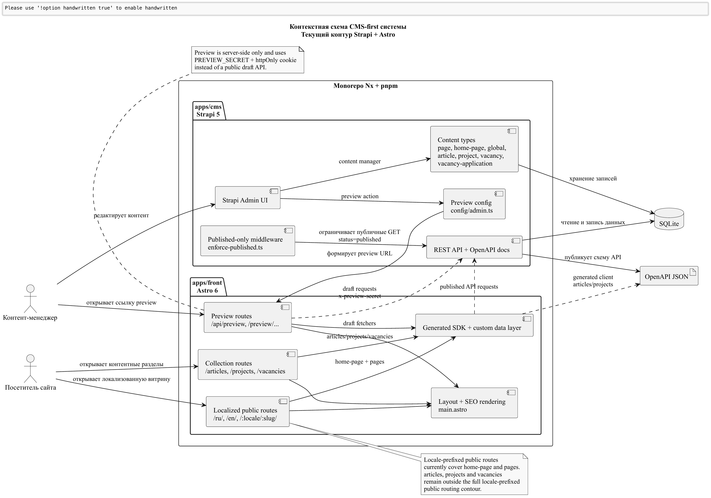
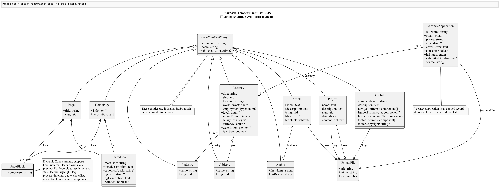
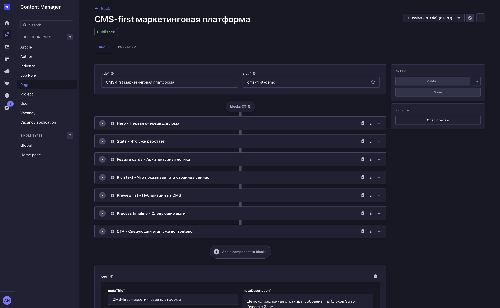
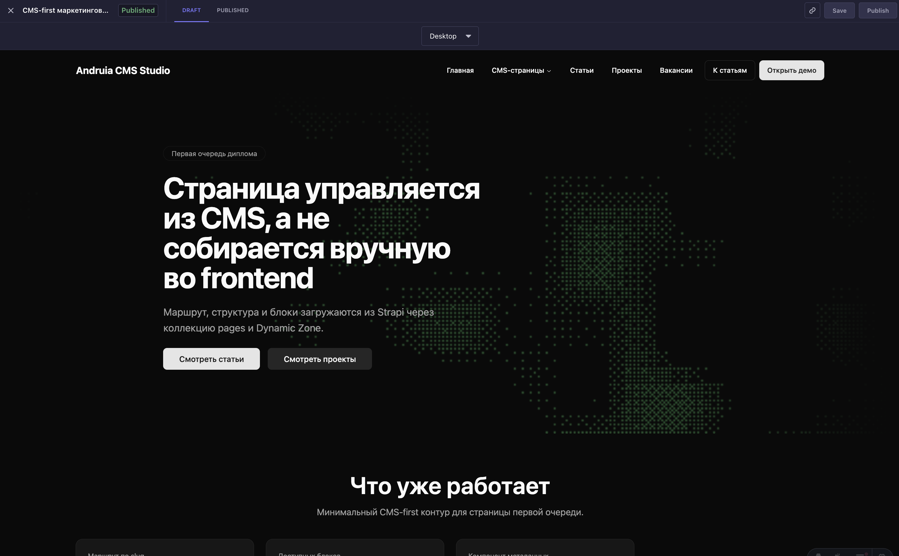
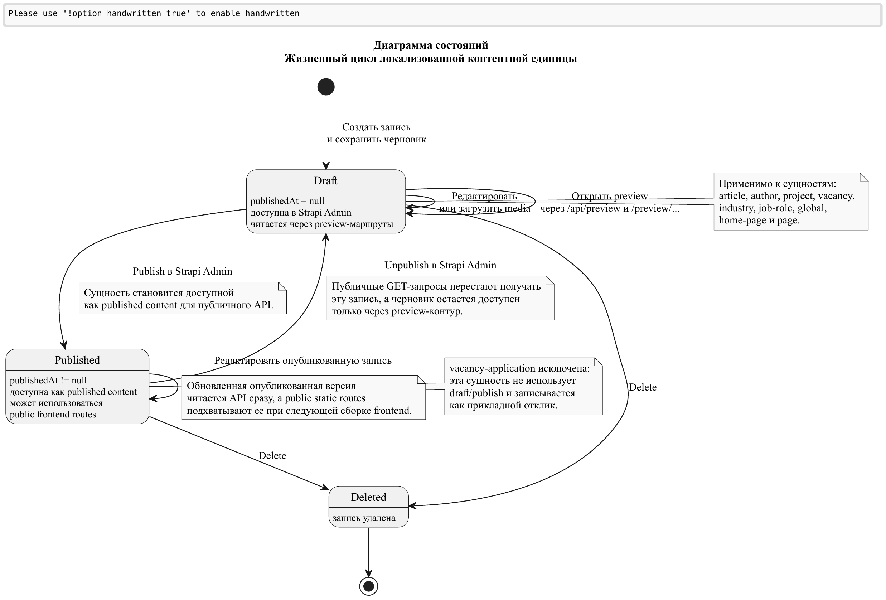

<!-- _class: lead -->

Выпускная квалификационная работа

# Разработка системы управления контентом в сфере маркетинга на базе `Strapi` и `Astro`

09.03.01 Информатика и вычислительная техника · Технологии разработки программного обеспечения

<strong>Исполнитель</strong> 
Нахатакян Артур Романович 
4 курс, очная форма обучения

<strong>Руководитель</strong> 
кандидат пед. наук, доцент кафедры информационных технологий и электронного обучения 
Государев Илья Борисович

РГПУ им. А. И. Герцена · Санкт-Петербург · 2026

---

## Актуальность

### Почему тема практична

- Корпоративный маркетинговый сайт требует частых изменений страниц, кейсов, статей и вакансий.
- При кодо-центричном подходе контент, `SEO` и локализация оказываются распределены между CMS, шаблонами и ручными правками.
- Типовые редакторские изменения замедляются, потому что зависят от разработчика.
- Для такой предметной области нужен предсказуемый сценарий: черновик, предпросмотр, публикация и обновление витрины.

ru/en
preview mode
SEO / sitemap

Публичная витрина должна обновляться из CMS, а не через ручную правку шаблонов.

---

## Объект, предмет, цель и задачи

### Исследовательская рамка

- **Объект:** процессы управления контентом корпоративного маркетингового сайта.
- **Предмет:** архитектурные и программные решения для `CMS-first` платформы на базе `Strapi` и `Astro`.
- **Цель:** разработать систему, позволяющую управлять страницами, статьями, кейсами и вакансиями без участия разработчика.

### Ключевые задачи

1. Обосновать выбор `headless CMS` и связки `Strapi + Astro`.
2. Спроектировать требования, архитектуру и модель данных.
3. Реализовать CMS-контур для `pages`, `articles`, `projects`, `vacancies`.
4. Добавить `ru/en`, `preview mode`, `SEO/Open Graph` и `sitemap`.
5. Организовать `roles/permissions`, `webhook -> rebuild`, `Vercel`, `Docker` и проверку результата.

---

## Выбор подхода и технологий

### `Headless CMS`

- Разделяет хранение контента и рендеринг витрины.
- Централизует editor workflow и API-контракт.
- Подходит для мультиязычного маркетингового сайта с разными публичными разделами.

### `Strapi 5`

- Гибкие `content types`, `Dynamic Zone` и media library.
- Встроенные `i18n`, `RBAC` и `webhooks`.
- Подходит как CMS-ядро для `pages`, `articles`, `projects`, `vacancies`.

### `Astro 6`

- `Prerender` для предсказуемой отдачи контента.
- Server routes для `preview` и форменных сценариев.
- Интеграция с `sitemap` и deployment на `Vercel`.

> Итоговый выбор обоснован задачей: передать управление маркетинговым контентом в CMS и оставить витрину легкой, статически собираемой и контролируемой.

---

## Архитектура системы

<strong>CMS-слой</strong> 
`Strapi` управляет контентом, ролями и публикацией.

<strong>Frontend-слой</strong> 
`Astro` строит публичные маршруты, preview и server-side формы.

<strong>Эксплуатационный слой</strong> 
`Vercel` и `Docker` замыкают deployment и rebuild-контур.

---

## Модель данных CMS

### Что включает модель

- `global`, `home-page`, `page`;
- `article`, `project`, `vacancy`;
- `author`, `industry`, `job-role`;
- единый компонент `shared.seo`;
- локализуемые поля для `storefront-core`, `articles` и `projects`;
- форменные сущности `lead-submission` и `vacancy-application`.

Сущности ориентированы на предметную область, а не на набор жестко зашитых шаблонов.

---

## Редакторский контур

### Редактирование страницы в `Strapi`

### Предпросмотр итоговой витрины

- `page` стала самостоятельной контентной единицей со `slug`, `SEO` и блоками `Dynamic Zone`.
- Редактор собирает страницу из готовых блоков без изменения frontend-кода.
- `preview mode` открывает `draft`-версию через защищенный server-side сценарий без раскрытия черновиков в публичном API.

---

## Публичная витрина и SEO-контур

### Реализованные возможности

- locale-prefixed публичные маршруты `/ru/` и `/en/` для storefront-core;
- `CMS-managed SEO/Open Graph` для `home-page`, `page`, `article`, `project`, `vacancy`;
- автоматическая генерация `sitemap` в build pipeline `Astro`;
- формы лидов и откликов проходят через `Astro server routes`, а не пишут напрямую в `Strapi` из браузера.

meta title
canonical
og:image
sitemap

Публичная витрина использует единый metadata pipeline и отдает уже собранные маршруты.

---

## Публикация, deployment и безопасность

### Эксплуатационный контур

- versioned webhook в `Strapi` подписан на `entry.publish` и `entry.unpublish`;
- frontend deployment ориентирован на `Vercel deploy hook`;
- CMS оформлена как `Docker` bundle с отдельным `PostgreSQL` runtime;
- роли: `administrator`, `marketer/content-manager`, `editor`, `HR`;
- `draft`-доступ выдается только через `preview-secret`, а public API ограничен опубликованными данными.

---

## Результаты и проверка

| Что проверено | Результат |
|---|---|
| Frontend build и prerender | Собирается `35` публичных HTML-маршрутов без `runtime errors`. |
| Preview contour | Черновики доступны только через `/api/preview` и `x-preview-secret`. |
| SEO и sitemap | Проверены `title`, `canonical`, `og`-поля и генерация `sitemap-index.xml`. |
| Форменные сценарии | `lead-submission` и `vacancy-application` валидируются на `server-side` и пишутся через технический токен. |
| Rebuild contour | Managed webhook зарегистрирован в `Strapi` и привязан к событиям `publish/unpublish`. |
| Security baseline | Public content API `read-only`; публикация отделена от редактирования ролями. |

Результаты опираются на локальную сборку, smoke-checks, runtime-проверки и прямую верификацию CMS/SQLite baseline.

---

## Практическая значимость и ограничения

### Практический эффект

- Редактор может создавать и публиковать страницы, статьи, кейсы и вакансии без изменения frontend-кода.
- Контент, `SEO` и локализация переводятся в единый `CMS-first` контур.
- Публикация становится воспроизводимой благодаря `webhook -> rebuild` и versioned deployment bundle.

### Текущие ограничения

- Полный browser-level `WCAG audit` и `Lighthouse baseline` не завершены.
- Внешний `Vercel deploy` не воспроизводился `end-to-end` внутри репозитория.
- Дальнейшее развитие: новые блоки `Dynamic Zone`, расширение workflow и аналитики контента.

---

<!-- _class: lead -->

## Заключение

# Разработана `CMS-first` система управления контентом для маркетингового сайта

`Strapi` используется как центр контентного управления, `Astro` — как публичная витрина с предсказуемой публикацией и build-based delivery.

Strapi + Astro
preview
SEO / sitemap
webhook -> rebuild

Спасибо за внимание

